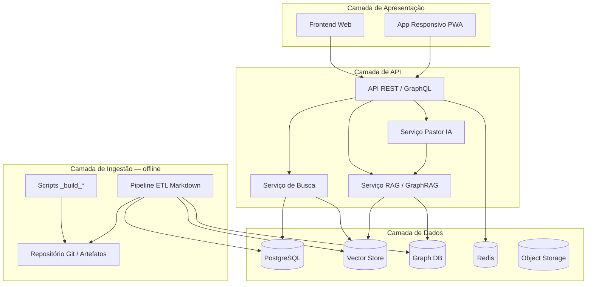
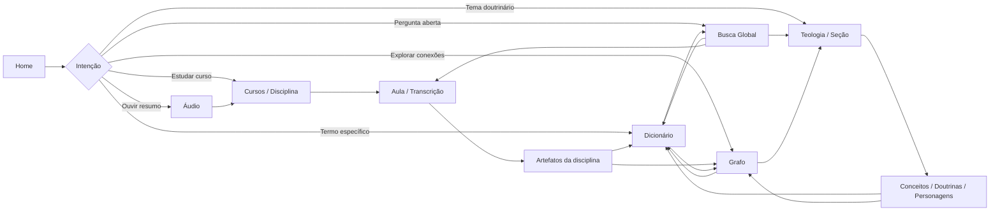
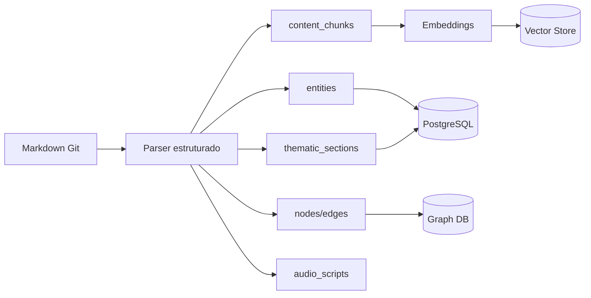
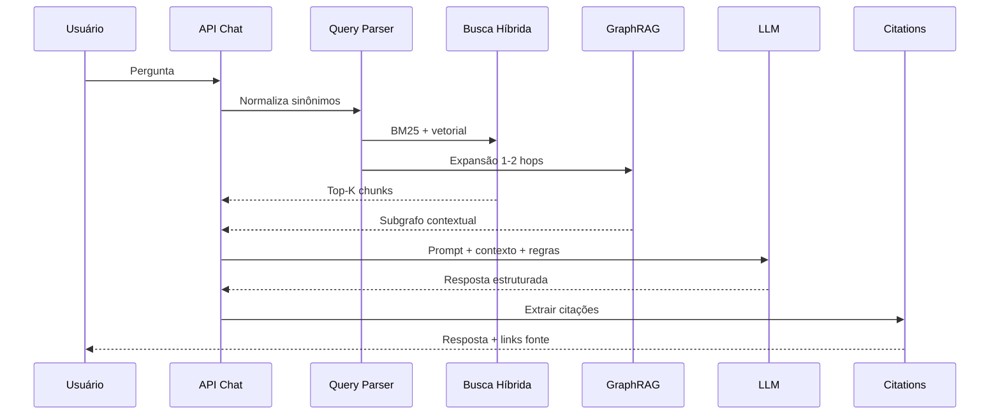

# ARQUITETURA DA PLATAFORMA WEB — Pastor IA

Documento de planejamento arquitetural da **Fase 3**. Define estrutura, módulos, navegação, integração dos artefatos globais e estratégias futuras. **Não implementa código.**

**Pré-requisitos concluídos (Fase 2):**

| Artefato | Local | Escala |
| :--- | :--- | ---: |
| `KB_BASICO_COMPLETO.md` | `90_Knowledge_Base/` | ~18.700 linhas |
| `DICIONARIO_GLOBAL.md` | `90_Knowledge_Base/` | 717 entradas |
| `INDICE_GLOBAL.md` | `90_Knowledge_Base/` | 15 seções temáticas |
| `GRAPH_RELATIONSHIPS.md` | `90_Knowledge_Base/` | 2.642 nós · 4.241 arestas |
| `AUDIO_OVERVIEW.md` | por disciplina (12) | 46.711 caracteres |

**Princípios obrigatórios herdados:** nunca inventar conteúdo teológico; priorizar fontes do projeto; preservar contexto histórico e bíblico; registrar disciplina de origem em toda consulta.

---

## 1. Estrutura Geral da Plataforma

A plataforma é um **sistema de consulta teológica integrada** organizado em camadas:



### Visão por domínios

| Domínio | Responsabilidade |
| :--- | :--- |
| **Conteúdo** | Cursos, disciplinas, aulas, artefatos Markdown |
| **Conhecimento** | KB global, dicionário, índice, grafo |
| **Descoberta** | Busca lexical, semântica e navegação temática |
| **Experiência** | Leitura, áudio, estudo guiado |
| **Inteligência** | RAG com citação de fontes; Pastor IA conversacional (fase posterior) |

### Escopo inicial (MVP Fase 3)

- Curso **Básico em Teologia** (12 disciplinas · 187 aulas)
- Consulta estruturada aos 4 artefatos globais + áudio por disciplina
- Busca híbrida (lexical + semântica) sem IA generativa em produção
- Interface web responsiva, sem autenticação complexa (opcional: modo leitura pública)

### Escopo futuro (Fases 4–7)

- Bíblia integrada com cross-reference
- Flashcards, mapas mentais, estudos
- Pastor IA conversacional com grounding obrigatório
- Cursos Médio e Bacharel

---

## 2. Módulos Principais

| Módulo | Função | Artefatos primários |
| :--- | :--- | :--- |
| **Home** | Entrada, busca global, atalhos temáticos | `INDICE_GLOBAL` |
| **Cursos** | Navegação por nível → disciplina → aula | Transcrições, `KB_MASTER` |
| **Teologia** | Navegação por área doutrinária (15 seções) | `INDICE_GLOBAL`, `KB_BASICO_COMPLETO` |
| **Dicionário** | Entrada alfabética, desambiguação, sinônimos | `DICIONARIO_GLOBAL` |
| **Grafo** | Exploração de entidades e relações | `GRAPH_RELATIONSHIPS` |
| **Doutrinas** | Visão consolidada de doutrinas bíblicas | `KB_BASICO_COMPLETO` (seção DOUTRINAS) |
| **Personagens e Eventos** | Biografias teológicas e linha do tempo | `INDICE_GLOBAL`, `GRAPH_RELATIONSHIPS` |
| **Geografia Bíblica** | Lugares, mapas conceituais | `KB_BASICO_COMPLETO` (GEOGRAFIA) |
| **Áudio** | Narração estilo overview por disciplina | `AUDIO_OVERVIEW` |
| **Busca** | Resultados unificados com filtros | Todos os artefatos indexados |
| **Pastor IA** *(futuro)* | Chat com citações e limites de fonte | RAG + grafo + Bíblia |
| **Bíblia** *(futuro)* | Leitor bíblico com notas teológicas | Versículos + `VERSICULOS.md` |
| **Admin / ETL** *(interno)* | Rebuild de artefatos, métricas, auditoria | Scripts `_build_*`, relatórios |

---

## 3. Fluxo de Navegação

### Fluxo principal do usuário



### Padrões de navegação transversal

1. **Breadcrumb contextual:** `Home > Teologia > Cristologia > Kenosis > Dicionário`
2. **Painel lateral de relações:** arestas do grafo para a entidade atual (top 10 por relevância)
3. **Disciplinas de origem:** badge clicável em toda página de entidade (`06 Pentateuco`, etc.)
4. **Voltar ao índice temático:** link fixo para seção correspondente em `INDICE_GLOBAL`

### Jornadas prioritárias (MVP)

| Persona | Jornada |
| :--- | :--- |
| Aluno do curso | Home → Disciplina → Aula → Conceitos relacionados |
| Pesquisador temático | Home → Cristologia → Conceito → Grafo → Dicionário |
| Consulta rápida | Home → Busca → Entrada do dicionário |
| Revisão auditiva | Home → Áudio → Disciplina → Aprofundar no KB |

---

## 4. Estrutura de Menus

### Menu principal (header)

```
[Logo Pastor IA]
├── Início
├── Cursos ▾
│   └── Básico em Teologia ▾
│       ├── 01 Introdução a Teologia
│       ├── … (12 disciplinas)
│       └── Ver todas
├── Teologia ▾
│   ├── Teologia · Bibliologia · Cristologia
│   ├── Pneumatologia · Soteriologia · Eclesiologia
│   ├── Escatologia · Hermenêutica · Homilética
│   ├── Apologética · Heresias · Geografia Bíblica
│   └── Personagens · Eventos · Livros Bíblicos
├── Dicionário
├── Grafo
├── Busca
├── Áudio
└── Pastor IA (desabilitado até Fase 7 — badge "Em breve")
```

### Menu secundário (footer / utilitários)

- Sobre o projeto · Fontes · Créditos (Instituto Teológico Renacer)
- Mapa do site · Métricas da base · Versão dos artefatos

### Menu contextual (sidebar — página de entidade)

- Definição consolidada
- Relações no grafo (entrantes / saíntes)
- Disciplinas relacionadas
- Versículos relacionados *(quando Bíblia integrada)*
- Áudio da disciplina âncora
- Ver na aula original

### Menu mobile

- Bottom bar: Início · Cursos · Busca · Dicionário · Mais
- Drawer "Mais": Teologia · Grafo · Áudio · Pastor IA

---

## 5. Estrutura de Páginas

### Mapa de rotas (conceitual)

| Rota | Página | Conteúdo |
| :--- | :--- | :--- |
| `/` | Home | Hero, busca, seções temáticas, disciplinas em destaque |
| `/cursos` | Lista de cursos | Por nível (Básico ativo; Médio/Bacharel placeholder) |
| `/cursos/basico` | Curso Básico | 12 disciplinas, métricas, progresso opcional |
| `/cursos/basico/:codigo` | Disciplina | KB_MASTER resumo, artefatos, aulas, áudio |
| `/cursos/basico/:codigo/aulas/:n` | Aula | Transcrição Markdown renderizada |
| `/teologia` | Índice temático | 15 cards → seções do `INDICE_GLOBAL` |
| `/teologia/:secao` | Seção temática | Conceitos, doutrinas, personagens, eventos, disciplinas |
| `/dicionario` | Índice A–Z | 717 entradas com filtro por categoria |
| `/dicionario/:slug` | Entrada | Definição consolidada, metadados, relações |
| `/grafo` | Explorador | Busca de nó, visualização, filtros por relação |
| `/grafo/:slug` | Entidade | Ficha + arestas + vizinhos |
| `/busca` | Resultados | Query + abas (Tudo, Dicionário, Teologia, Aulas, Grafo) |
| `/audio` | Biblioteca áudio | 12 disciplinas com player |
| `/audio/:codigo` | Player | `AUDIO_OVERVIEW` + link para disciplina |
| `/pastor-ia` | Chat *(futuro)* | Interface conversacional |
| `/biblia` | Leitor *(futuro)* | Livro / capítulo / versículo |

### Template de página — Entidade do Dicionário

```
┌─────────────────────────────────────────────────────────┐
│ Breadcrumb · Disciplinas (badges) · Categoria           │
├─────────────────────────────────────────────────────────┤
│ TÍTULO DO TERMO                                         │
│ Definição consolidada (markdown)                        │
├──────────────────────┬──────────────────────────────────┤
│ Relações no grafo    │ Disciplinas relacionadas         │
│ (subgrafo local)     │ (lista com links)                │
├──────────────────────┴──────────────────────────────────┤
│ Termos relacionados · Sinônimos unificados · Fontes     │
└─────────────────────────────────────────────────────────┘
```

### Template de página — Seção temática

Espelha a estrutura de `INDICE_GLOBAL.md`: cinco listas (conceitos, doutrinas, personagens, eventos, disciplinas) com contagem e link para dicionário/grafo.

---

## 6. Estrutura de Busca

### Tipos de busca

| Tipo | Motor | Uso |
| :--- | :--- | :--- |
| **Lexical (BM25)** | PostgreSQL FTS / OpenSearch | Termos exatos, nomes, referências |
| **Semântica (vetorial)** | pgvector / Qdrant | Perguntas conceituais, sinônimos |
| **Grafo** | Neo4j / Apache AGE | Expansão por entidade e relação |
| **Híbrida (recomendada)** | Reciprocal Rank Fusion | Busca global padrão |

### Índices por fonte

| Fonte | Unidade de indexação | Campos indexados |
| :--- | :--- | :--- |
| `DICIONARIO_GLOBAL` | 1 chunk / entrada | termo, definição, sinônimos, categoria |
| `INDICE_GLOBAL` | 1 chunk / item de lista | seção, tipo (conceito/doutrina/…), nome |
| `KB_BASICO_COMPLETO` | 1 chunk / `###` bloco | título, corpo, fontes, seção H1 |
| `GRAPH_RELATIONSHIPS` | nó + aresta | entidade, relação, disciplina |
| `AUDIO_OVERVIEW` | 1 chunk / parágrafo lógico | texto narrativo + disciplina |
| Transcrições | 1 chunk / bloco de aula | texto, disciplina, número da aula |

### Interface de busca

```
┌──────────────────────────────────────────────────────────┐
│ 🔍  Buscar teologia, personagens, doutrinas…            │
│ Filtros: [Tudo ▾] [Disciplina ▾] [Categoria ▾]          │
└──────────────────────────────────────────────────────────┘
│ Abas: Todos · Dicionário · Teologia · Aulas · Grafo     │
├──────────────────────────────────────────────────────────┤
│ Resultado 1 — Dicionário · Cristologia                  │
│ Trecho com highlight… · 11 Os Evangelhos                │
├──────────────────────────────────────────────────────────┤
│ Resultado 2 — Grafo · Jesus Cristo → Reino de Deus      │
└──────────────────────────────────────────────────────────┘
```

### Regras de ranking (MVP)

1. Match exato no dicionário (boost máximo)
2. Match em título de seção temática
3. BM25 no corpo do `KB_BASICO_COMPLETO`
4. Similaridade vetorial (cosine) com threshold ≥ 0.75
5. Expansão opcional via grafo (1 hop) para resultados relacionados

### Normalização pré-busca

Reutilizar mapa de sinônimos da Fase 2 (`Renacer/Renacê`, `Gnosticismo/guinoticismo`, etc.) no query parser.

---

## 7. Integração dos Artefatos

### Papel de cada artefato na plataforma

| Artefato | Papel na UI | Camada de dados | Atualização |
| :--- | :--- | :--- | :--- |
| **KB_BASICO_COMPLETO** | Conteúdo longo: doutrinas, conceitos, seções temáticas | PostgreSQL `content_chunks` + vetores | `_build_kb_basico.py` |
| **DICIONARIO_GLOBAL** | Páginas de termo; resultado prioritário na busca | Tabela `entities` + `entity_definitions` | `_build_dicionario_global.py` |
| **INDICE_GLOBAL** | Menu Teologia; landing das 15 seções | Tabela `thematic_sections` + `section_items` | `_build_indice_global.py` |
| **GRAPH_RELATIONSHIPS** | Sidebar de relações; explorador de grafo | Graph DB `nodes` / `edges` | `_build_graph_relationships.py` |
| **AUDIO_OVERVIEW** | Player por disciplina; TTS futuro | Object storage + metadados em PG | Manual / pipeline áudio |

### Fluxo de ingestão (ETL)



### Contrato de metadados (todas as entidades)

```yaml
id: uuid
slug: string          # URL-safe
nome_canonico: string
categoria: enum       # Pessoa | Lugar | Doutrina | …
disciplinas: string[] # ["11 Os Evangelhos", …]
fontes: string[]      # artefato + versão
fase: 2
nivel: "Básico em Teologia"
```

### Sincronização

- Versão dos artefatos exposta na UI (frontmatter YAML: `versao: 1.0.0`)
- Rebuild ETL disparado após commit nos scripts `_build_*`
- Cache Redis invalidado por versão de artefato

---

## 8. Estratégia Futura — Bíblia Integrada (Fase 4)

### Objetivo

Integrar texto bíblico canônico com as notas teológicas já catalogadas em `VERSICULOS.md` (12 disciplinas) e referências do `DICIONARIO_GLOBAL`.

### Abordagem recomendada

| Etapa | Ação |
| :--- | :--- |
| 1 | Adotar schema de versículos canônicos (`GEN_1_1`, `MAT_5_3`) conforme `PADRAO_OFICIAL_PASTOR_IA.md` |
| 2 | Importar tradução licenciada (ex.: ARA, NVI, ou domínio público) em tabela `bible_verses` |
| 3 | Vincular `VERSICULOS.md` por disciplina → `verse_id` + `usage_teologico` |
| 4 | Cross-link: entidade do dicionário ↔ versículos relacionados |
| 5 | UI: painel lateral "Notas do Curso" ao ler capítulo |

### Modelo conceitual

```
Livro → Capítulo → Versículo
                    ├── texto_biblico
                    ├── anotacoes_curso[]  (disciplina, aula, uso teológico)
                    └── entidades_grafo[]  (personagens, doutrinas)
```

### Não duplicar

- Versículos permanecem na Bíblia como fonte primária
- `KB_BASICO_COMPLETO` e dicionário **referenciam** `verse_id`, não copiam texto integral

---

## 9. Estratégia Futura — IA Conversacional (Fase 7)

### Identidade: Pastor IA

Assistente teológico **grounded** — responde exclusivamente com base nas fontes do projeto; cita disciplina e artefato; recusa especulação doutrinária não fundamentada.

### Pipeline RAG recomendado



### Regras do sistema (prompt policy)

1. Priorizar `DICIONARIO_GLOBAL` para definições
2. Priorizar `KB_BASICO_COMPLETO` para exposição doutrinária
3. Usar `GRAPH_RELATIONSHIPS` para perguntas de relação ("o que contradiz X?")
4. Nunca inventar versículos — consultar índice bíblico (Fase 4+)
5. Exibir sempre: **Fontes consultadas** com link para página da plataforma

### Modos de conversa (futuro)

| Modo | Contexto injetado |
| :--- | :--- |
| Estudo livre | Busca global |
| Por disciplina | Chunks filtrados por `disciplina_id` |
| Por tema | Seção do `INDICE_GLOBAL` |
| Apologética | Seções HERESIAS + APOLOGÉTICA |
| Devocional | Áudio + trecho bíblico *(opcional)* |

### Guardrails

- Temperature baixa (0.2–0.4)
- Resposta máxima com citação obrigatória
- Log de retrieval para auditoria teológica
- Rate limiting e custo por tokens

---

## 10. Estrutura Recomendada de Banco de Dados

### PostgreSQL (dados relacionais + FTS + pgvector)

```sql
-- Hierarquia de conteúdo
courses (id, nivel, nome, slug, status)
disciplines (id, course_id, codigo, nome, slug, aulas_total, professor)
lessons (id, discipline_id, numero, titulo, slug, transcricao_path)

-- Entidades do dicionário
entities (id, slug, nome, categoria, frequencia, versao_artefato)
entity_definitions (entity_id, texto, disciplinas[], fontes[], sinônimos[])
entity_relations (source_id, relation_type, target_id, disciplina, fonte)

-- Índice temático
thematic_sections (id, slug, nome, descricao, ordem)
section_items (section_id, entity_id, item_type, ordem)

-- Chunks para RAG
content_chunks (
  id, source_type, source_id, discipline_id,
  titulo, corpo, metadata_json,
  embedding vector(1536),
  tsv tsvector
)

-- Áudio
audio_overviews (id, discipline_id, texto, caracteres, audio_url, status)

-- Versão e auditoria
artifact_versions (artefato, versao, hash, built_at)
```

### Graph DB (Neo4j ou PostgreSQL + Apache AGE)

```
(:Entity {slug, nome, categoria, disciplinas[]})
-[:RELATION {tipo, disciplina, fonte}]->(:Entity)
```

Tipos de relação alinhados ao `GRAPH_RELATIONSHIPS.md`: `ensina`, `menciona`, `conecta`, `contradiz`, `deriva_de`, `ocorre_em`, `associado_a`, `relacionado_a`, `fundamentado_em`, `explicado_por`.

### Vector Store

- **Opção A (simples):** pgvector na mesma instância PostgreSQL
- **Opção B (escala):** Qdrant dedicado para milhões de chunks futuros

### Redis

- Cache de páginas de entidade (TTL 1h)
- Cache de resultados de busca (TTL 15min, chave = query hash + filtros)
- Sessões de chat (futuro)

### Object Storage (S3 / MinIO)

- `AUDIO_OVERVIEW` texto (backup)
- Arquivos de áudio gerados (ElevenLabs)
- Exportações PDF futuras

---

## 11. Estrutura Recomendada de API

### Estilo

- **REST** para CRUD e navegação (simplicidade, cache HTTP)
- **GraphQL** opcional para explorador de grafo (queries aninhadas)
- Versionamento: `/api/v1/`

### Endpoints principais (REST)

| Método | Endpoint | Descrição |
| :--- | :--- | :--- |
| GET | `/api/v1/courses` | Lista cursos |
| GET | `/api/v1/disciplines/:slug` | Disciplina + metadados |
| GET | `/api/v1/disciplines/:slug/lessons` | Aulas |
| GET | `/api/v1/lessons/:slug` | Transcrição renderizável |
| GET | `/api/v1/theology/sections` | 15 seções (`INDICE_GLOBAL`) |
| GET | `/api/v1/theology/sections/:slug` | Itens da seção |
| GET | `/api/v1/dictionary` | Lista paginada A–Z |
| GET | `/api/v1/dictionary/:slug` | Entrada completa |
| GET | `/api/v1/graph/nodes/:slug` | Nó + arestas |
| GET | `/api/v1/graph/nodes/:slug/neighbors` | Vizinhos filtráveis |
| GET | `/api/v1/search` | `?q=&type=&discipline=&limit=` |
| GET | `/api/v1/audio/:discipline_slug` | Script + URL áudio |
| POST | `/api/v1/chat` *(futuro)* | Mensagem → resposta RAG |
| GET | `/api/v1/bible/:ref` *(futuro)* | Versículo + anotações |

### Formato de resposta padrão

```json
{
  "data": { },
  "meta": {
    "versao_artefato": "1.0.0",
    "fontes": ["DICIONARIO_GLOBAL"],
    "disciplinas": ["11 Os Evangelhos"]
  },
  "pagination": { "page": 1, "total": 717 }
}
```

### Serviços internos (micro-monólito modular)

```
api/
├── content/      # cursos, aulas
├── knowledge/    # dicionário, teologia, KB chunks
├── graph/        # nós, arestas, traversals
├── search/       # híbrido BM25 + vector
├── audio/        # scripts e mídia
└── chat/         # RAG (futuro)
```

---

## 12. Estrutura Recomendada de Frontend

### Stack recomendada (decisão de design — não implementar agora)

| Camada | Tecnologia sugerida | Justificativa |
| :--- | :--- | :--- |
| Framework | **Next.js 14+** (App Router) | SSR/SSG para SEO teológico; rotas alinhadas ao mapa de páginas |
| Linguagem | TypeScript | Tipagem para entidades e API |
| Estilo | Tailwind CSS + design tokens | Consistência, tema claro/escuro |
| Componentes | shadcn/ui ou equivalente | Acessibilidade, velocidade de MVP |
| Markdown | MDX / react-markdown | Renderização de transcrições e KB |
| Grafo | Cytoscape.js ou vis-network | Visualização interativa do grafo |
| Busca | Command palette (⌘K) + página /busca | Padrão moderno de descoberta |
| Estado | TanStack Query | Cache de API, revalidação |
| Áudio | HTML5 Audio + playlist simples | `AUDIO_OVERVIEW` |

### Estrutura de diretórios (conceitual)

```
app/
├── page.tsx                    # Home
├── cursos/
│   └── basico/
│       └── [codigo]/
│           ├── page.tsx        # Disciplina
│           └── aulas/[n]/page.tsx
├── teologia/
│   └── [secao]/page.tsx
├── dicionario/
│   ├── page.tsx
│   └── [slug]/page.tsx
├── grafo/
│   ├── page.tsx
│   └── [slug]/page.tsx
├── busca/page.tsx
├── audio/
│   └── [codigo]/page.tsx
└── pastor-ia/page.tsx          # futuro

components/
├── layout/       # Header, Footer, Sidebar, Breadcrumb
├── search/       # SearchBar, ResultsList, Filters
├── entity/       # EntityCard, Definition, RelationPanel
├── graph/        # GraphExplorer, NodeDetail
├── audio/        # AudioPlayer, DisciplinePlaylist
└── markdown/     # SafeRenderer para KB e aulas
```

### Design system — diretrizes

- Tipografia serifada para conteúdo teológico longo; sans para UI
- Paleta sóbria (azul-escuro, dourado discreto, fundo off-white)
- Cards para entradas do dicionário e seções temáticas
- Badge de disciplina sempre visível
- Modo leitura: largura máxima 720px, interlineagem 1.6

### Performance (metas)

| Métrica | Meta MVP |
| :--- | :--- |
| LCP | < 2.5s |
| Página dicionário (SSG) | < 100ms TTFB |
| Busca | < 500ms p95 |
| Grafo (50 nós) | render < 1s |

### Acessibilidade

- WCAG 2.1 AA
- Navegação por teclado no explorador de grafo
- Transcrições como alternativa ao áudio

---

## Roadmap de Implementação (pós-arquitetura)

| Ordem | Entrega | Dependência |
| :---: | :--- | :--- |
| 1 | ETL: Markdown → PostgreSQL + entidades | Fase 2 artefatos |
| 2 | API REST v1 (conteúdo + dicionário + teologia) | ETL |
| 3 | Frontend MVP (Home, Cursos, Dicionário, Teologia) | API |
| 4 | Busca híbrida + página /busca | Embeddings |
| 5 | Explorador de grafo | Graph DB |
| 6 | Módulo áudio | Object storage |
| 7 | Bíblia integrada | Licenciamento texto |
| 8 | Pastor IA conversacional | RAG + guardrails |

---

## Restrições desta fase

- **Não implementar:** HTML, CSS, Flask, FastAPI, React, banco de dados, deploy
- **Não inventar** conteúdo teológico na arquitetura
- **Não executar** `git push` sem autorização explícita
- Próximo passo após aprovação deste documento: especificação técnica de ETL e contratos OpenAPI

---

## Referências

- [`AGENTS.md`](AGENTS.md) — visão e fases do projeto
- [`PADRAO_OFICIAL_PASTOR_IA.md`](PADRAO_OFICIAL_PASTOR_IA.md) — padrões de artefatos
- [`90_Knowledge_Base/`](90_Knowledge_Base/) — artefatos globais Fase 2
- [`ROADMAP.md`](ROADMAP.md) — planejamento de fases
